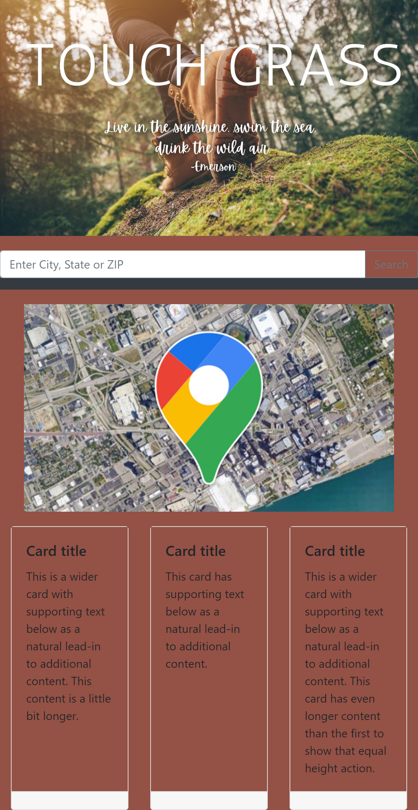

# Touch-Grass-App
Touch Grass App allows users to search for national parks by state. When searched, the user will see a list of the state parks in their specified state along with the website link and location on Google Maps. 

This 3-day project introduced 4 students to the barriers and challenges that collaborative work brings. This was also the first time the students used a third-party API's in an assignment. 
     
Touch Grass App is designed by Paulo Condori Pinedo, Ashley Thompson, Vincent Yang, and Jules Franklin.

## July 5

Group members proposed ideas for the project. The initial main ideas for the project were:
    * Providing location and information for people interested in hiking
    * Providing location and information for people interested in going to rivers
    * Providing location and information for people interested in going to parks in Georgia

Final Decision on proposed ideas:

    * The ideas for hiking and rivers were deemed too specific to finish in the limited time frame.
    The reason why it was deemed as such was because team members searched the web to look for 
    free and accessable API to use but unfortunately the API's that were found required extensive work to 
    fetch and pull that specific data. Some API looked at:
        - https://www.esri.com/arcgis-blog/products/national-government/national-government/n[…]-rivers-project-a-recreational-rivers-geospatial-map-database/
        - https://rapidapi.com/search/outdoor

    - The final(tentative) decision was to pursue the Parks in Georgia idea due to the fact there were a decent amount of 
API's that we could use to fetch and pull the information we wanted. 

## Brief Summary of the Work done after the decision was made:

The group was split into two groups. One focused on the UX/UI design and another on the API fetch code. 

API -

    Group looked through API's and ran into issues. Issues with accessablility were that they were not all open source 
    and/or had good documentation. 
    - https://ridb.recreation.gov/docs
    - https://prescriptiontrails.org/api/
    - https://www.trailforks.com/about/api/#!/trails/getTrails_get_0

    They worked on it for a couple of hours before reaching the conclusion that a change of the project goal would
    be beneficial to the group as the issues were too obtuse to solve in the allowed time frame. The group as a whole 
    discussed possible ideas to move forward, the ideas had to be something that similiar the UX design was made with 
    idea of users knowing it was a website focused on outdoors activities. 

    We decided to now pursue a website that show national parks for a state searched by the user.

UX/UI  -

    The first draft of the of the HTML/CSS skeleton was produced. We used BootStrap for our HTML skeleton. Most of 
    of customization was complete but we left certain 
 elements to hold the Google maps API info, fetch results from User input, information pull
    from weather API's.

## SUMMARY OF DAY 1:

    UX design first draft completed.
    Group changed scope to National Park. 
    We now focused on making a website that would show the parks in the State the user searched for.
    Another goal was to use Google Maps API on our website. How we were gonna use and implemment it 
    was still in queston but our main focused on the first API the user would interact with.

 

## July 6 - 

    API - 

    Decide on NPS API 
    Primary goal was to access the information we need to show on our HTML. All code was writen on 
    separate branches before modifying the main branch. Much time was spent on resolving the 
    reason by some fetch requests were blocked. After the focus was finding a way to sort Data.

    UX-UI -

    Created Hero image on canvas and made it mobile responsive. 

    ## SUMMARY OF DAY 2:
    
    Most of the focus was working to find a way to sort the data from 
    the fetch request.

## July 7 - 
    API -
    Fixed Google Maps issues and added map functionality.

    UX-UI-

    Slight changes on CSS as it caused issues with display fetch return data. The primary example was with the use 
    of " * " in CSS. If you aplied a background-color in CSS in the " * " section, it would cover the data display on 
    your webpage.

## Conclusion:

    The following images demonstrate the app's functionality:  
    
  

## Deployed Application
https://ashley1thompson.github.io/touch-grass-app-national-park-finder/

## Github Repo Link
https://github.com/Ashley1Thompson/touch-grass-app-national-park-finder